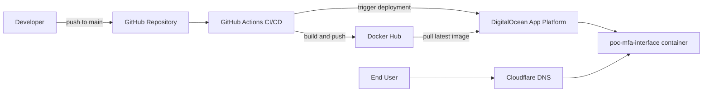

# PoC MFA Interface

Proof of concept for a secure and accessible multi-factor authentication (MFA) user interface.

## Live App

- https://poc-mfa-interface.cava881.xyz/

## Tech Stack

- Frontend: HTML, CSS, JavaScript, Bootstrap
- Containerization: Docker, Nginx (alpine image)
- CI/CD: GitHub Actions
- Registry: Docker Hub
- Hosting: DigitalOcean App Platform
- DNS: Cloudflare

## Project Scope

This PoC focuses on the frontend experience of MFA flows, with special attention to security and accessibility.

Design and interaction choices are guided by:

- [Universal Design](https://en.wikipedia.org/wiki/Universal_design)
- [WCAG 2.1](https://www.w3.org/TR/WCAG21/)
- [Assistive Technology](https://en.wikipedia.org/wiki/Assistive_technology)
- [ICF framework](https://icd.who.int/dev11/l-icf/en#/)

At this stage, no backend is implemented. Future development can integrate a [WebAuthn](https://webauthn.io/) backend.

## Run Locally

Build the Docker image:

```bash
docker build -f Dockerfile -t poc-mfa-interface .
```

Run the container:

```bash
docker run --rm -p 8080:80 poc-mfa-interface
```

Open the app:

```text
http://localhost:8080
```

## Deployment Architecture

The application is containerized with Docker, published to Docker Hub, and deployed on DigitalOcean App Platform. Cloudflare DNS is used for domain routing.



Deployment flow:

1. Build the frontend Docker image
2. Push the image to Docker Hub
3. DigitalOcean App Platform pulls the image and deploys it
4. Cloudflare routes the custom domain to the deployed app

## CI/CD

CI/CD is implemented with GitHub Actions in [.github/workflows/main.yaml](.github/workflows/main.yaml).

Trigger:

1. Push to the `main` branch

Pipeline:

1. Checkout repository
2. Configure Docker Buildx and QEMU
3. Log in to Docker Hub
4. Build and push multi-architecture images (`linux/amd64`, `linux/arm64`)
5. Deploy to DigitalOcean App Platform

Required GitHub configuration:

Variables:

1. `DOCKERHUB_USERNAME`

Secrets:

1. `DOCKERHUB_TOKEN`
2. `DIGITALOCEAN_TOKEN`
